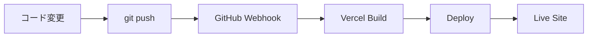

# GitHub-Vercel自動デプロイ設定ガイド

## 前提条件
- GitHubアカウント
- Vercelアカウント
- SALT'NBASE.のコードがGitHubリポジトリにある

## Step 1: GitHubリポジトリの準備

### 1.1 リポジトリの確認
```bash
# 現在のリモートリポジトリを確認
git remote -v

# 出力例:
# origin  https://github.com/YDMaruyama/SALT-NBASE.WEBsite.git (fetch)
# origin  https://github.com/YDMaruyama/SALT-NBASE.WEBsite.git (push)
```

### 1.2 最新コードのプッシュ
```bash
# 変更をコミット
git add .
git commit -m "Add Vercel configuration and SEO optimization"

# GitHubにプッシュ
git push origin main
```

## Step 2: Vercelでの設定

### 2.1 新規プロジェクトとして連携（推奨）

1. **Vercelダッシュボード**: https://vercel.com/dashboard
2. **"Add New..." > "Project"** をクリック
3. **"Import Git Repository"** を選択
4. **GitHubアカウントを連携**（未連携の場合）
5. **リポジトリを選択**: `YDMaruyama/SALT-NBASE.WEBsite` を選択
6. **設定確認**:
   ```
   Project Name: salt-nbase
   Framework Preset: Vite
   Root Directory: ./
   Build Command: npm run build
   Output Directory: dist
   Install Command: npm install
   ```
7. **"Deploy"** をクリック

### 2.2 既存プロジェクトに連携

1. **既存のVercelプロジェクト** を選択
2. **Settings > Git** に移動
3. **"Connect Git Repository"** をクリック
4. **GitHubリポジトリを選択**: `YDMaruyama/SALT-NBASE.WEBsite`
5. **ブランチ設定**:
   - Production Branch: `main`
   - Auto-deploy: `Enabled`

## Step 3: 自動デプロイの確認

### 3.1 テストコミット
```bash
# 小さな変更を加える
echo "<!-- Test auto-deploy -->" >> public/robots.txt

# コミット＆プッシュ
git add .
git commit -m "Test auto-deploy"
git push origin main
```

### 3.2 デプロイ状況の確認
1. **Vercelダッシュボード** でデプロイ状況を確認
2. **"Deployments"** タブで進行状況を監視
3. **成功時**: ✅ Ready
4. **失敗時**: ❌ Error（ログを確認）

## Step 4: 環境変数の設定（必要に応じて）

### 4.1 Vercelでの環境変数設定
```
Settings > Environment Variables

例:
VITE_SITE_URL=https://salt-nbase.vercel.app
VITE_GA_ID=G-XXXXXXXXXX（Google Analytics）
```

### 4.2 本番環境用の設定
```javascript
// vite.config.ts
export default defineConfig({
  // ... 既存設定
  define: {
    __SITE_URL__: JSON.stringify(process.env.VITE_SITE_URL || 'https://salt-nbase.vercel.app')
  }
});
```

## Step 5: カスタムドメインの設定（オプション）

### 5.1 独自ドメインの追加
1. **Settings > Domains**
2. **"Add Domain"** をクリック
3. **ドメイン名を入力**: `saltnbase.jp`
4. **DNS設定を更新**:
   ```
   Type: CNAME
   Name: www
   Value: cname.vercel-dns.com
   
   Type: A
   Name: @
   Value: 76.76.19.61
   ```

## トラブルシューティング

### 問題1: デプロイが開始されない
**原因**: Webhook未設定
**解決**: 
1. GitHub Settings > Webhooks を確認
2. Vercelとの連携を再設定

### 問題2: ビルドエラー
**原因**: 依存関係やビルド設定の問題
**解決**:
```bash
# ローカルでビルドテスト
npm run build

# エラーがある場合は修正してからプッシュ
```

### 問題3: 環境変数が反映されない
**原因**: Vercelの環境変数設定漏れ
**解決**: Settings > Environment Variables で設定

## 確認チェックリスト

- [ ] GitHubリポジトリが最新
- [ ] Vercelプロジェクトがリポジトリに連携
- [ ] Production Branchが正しく設定（main）
- [ ] Auto-deployが有効
- [ ] テストデプロイが成功
- [ ] カスタムドメイン設定（必要に応じて）
- [ ] 環境変数設定（必要に応じて）

## 自動デプロイの流れ



1. **開発者がコードを変更**
2. **`git push origin main`**
3. **GitHubがVercelにWebhook送信**
4. **Vercelが自動ビルド開始**
5. **ビルド成功後、本番環境に自動デプロイ**
6. **サイトが更新される**

これで、コードをプッシュするだけで自動的にサイトが更新されるようになります。

**リポジトリ名**: `YDMaruyama/SALT-NBASE.WEBsite`
**Vercel連携**: 完了済み